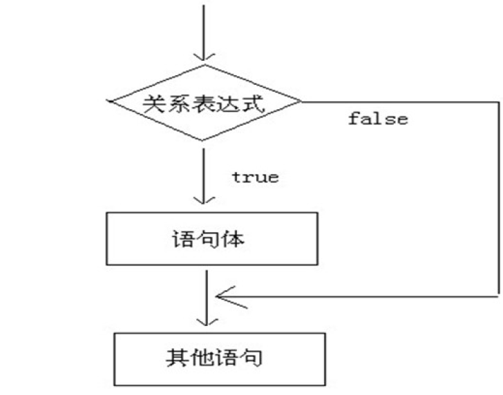

# 流程控制语句

**关键词**


---

# 笔记

## 流程控制

### 顺序结构

```java
// 顺序结构
public class Demo01Sequence {
	public static void main(String[] args) {
		System.out.println("今天天气不错");
	System.out.println("");
		System.out.println("我们下午没课");
		System.out.println("这的确挺爽的");
	}

}
```
### 判断语句
#### 1 判断语句1 --`if

- 格式

```java
if(关系表达式) {
    语句体;
}
```
- 执行流程
    - 首先判断关系表达式是否为true和flase
    - 如果是true执行语句体
    - 如果是flase不执行语句体

```java

// 单if语句
public class Demo02If {
	public static void main(String[] args) {
		System.out.println("今天天气不错，正在压马路……突然发现一个快乐的地方：网吧");
		int age = 19;
		if (age >= 18) {
			System.out.println("进入网吧，开始high！");
			System.out.println("遇到了一群猪队友，开始骂街。");
			System.out.println("感觉不爽，结账走人。");
		}
		System.out.println("回家吃饭");
	}
}
```
### 标准的`if-esle`语句
**求奇数偶数**
```java

package com.dj.day04.demo03;

public class IfElse {
    public static void main(String[] args) {
        int num = 666;
        if (num % 2 == 0) {
            System.out.println("偶数");
        } else{
            System.out.println("奇数");
        }
    }
}

```
**练习**
```md
x和y的关系满足如下：
如果x >= 3，那么y = 2x + 1;
如果-1 < x < 3，那么y = 2x;
如果x <= -1，那么y = 2x – 1;
```
```java
public class IfElseExt {
    public static void main(String[] args) {
        int x =10;
        int y;
        if (x >=3) {
            y = 2 * x + 1;
        } else if (-1 < x && x < 3) {
            y = 2 * x;
        } else {
           y = 2*x -1;
        }
        System.out.println("结果是"+ y);

    }
}
```
**成绩优秀判断**
```java
public class IfElsePractise {
    public static void main(String[] args) {
        int score =110;
        if (score >= 90 && score <= 100) {
            System.out.println("优秀");
        } else if (score >=80 && score <90) {
            System.out.println("好");
        } else if (score >= 70 && score <90) {
            System.out.println("良");
        } else if (score >= 60 && score <70) {
            System.out.println("及格");
        } else if (score >=0 && score <60) {
            System.out.println("不及格");
        } else {
            System.out.println("数据错误");
        }

    }
}
```
**题目：使用三元运算符和标准的if-else语句分别实现：取两个数字当中的最大值**
```java

public class Max {
    public static void main(String[] args) {
        int a = 105;
        int b = 220;
        //使用三元运算符
//        int max = a > b ? a : b;
        int max;
        if (a > b) {
             max =a;
        } else {
            max = b;
        }
        System.out.println(max);

    }
}
```
### `switch case`
```java

public class Switch01 {
    public static void main(String[] args) {
        int num =7;
        switch (num) {
            case  1:
                System.out.println("星期一");
                break;
            case  2:
                System.out.println("星期二");
                break;
            case  3:
                System.out.println("星期三");
                break;
            case  4:
                System.out.println("星期四");
                break;
            case  5:
                System.out.println("星期五");
                break;
            case  6:
                System.out.println("星期六");
                break;
            case  7:
                System.out.println("星期日");
                break;
            default:
                System.out.println("数据不合理");
                break;
        }
    }
}
```
- 注意事项
   - 最后一个default的break是可以省略的,但是强烈建议不要省略
   - 多个case后面的数值不可以重复
   - switch后面跟着的只可以是一下数据类型
     - 基本数据类型byte/short/char/int
     - 引用数据类型String和枚举(enum)
   - switch语句灵活,前后顺序可以颠倒,而且break语句可以省略
    - “匹配哪一个case就从哪一个位置向下执行，直到遇到了break或者整体结束为止。”
---
```java

public class SwitchNotice {
    public static void main(String[] args) {
        int num = 2;
        switch (num) {
            case 1:
                System.out.println("你好");
                break;
            case 2:
                System.out.println("我好");
//                break;
            case 3:
                System.out.println("大家好");
                break;
            default:
                System.out.println("您好,我也好");
                break;
        }

    }
}
```

循环结构的基本组成部分,一般可以分成四个部分
1. **初始化语句** : 在循环开始最初执行,而且只做唯一一次
2. **循环条件** :如果成立,泽循环继续,如果不成立,泽循环退出
3. **循环体** :重复要做的事情内容,若干行语句
4. **进步语句** :每次循环之后都要进行扫尾工作,每次循环结束之后要执行一次

```java

public class For1 {
    public static void main(String[] args) {
        for (int i = 1; i < 101; i++) {
            System.out.println();
            System.out.println("原谅我" + i);
        }
        System.out.println("程序停止");

    }
}
```


### while语句

`while` 有一个标准格式和一个扩张格式

- 标准格式
```java
while(条件判断) {
    循环体
}
```

- 扩展格式

```java
初始化条件语句
while(条件语句) {
    循环体;
    进步语句;
}
```

```java
public class While {
    public static void main(String[] args) {
        for (int i = 0; i < 10; i++) {
            System.out.println("我错了");
        }
        System.out.println("===========");
        int i = 0;
        while (i<10) {
            System.out.println("我错了");
            i++;
        }
    }
}
```

### do-while循环
- `do while`标准格式
```java
do{
    循环体
}
while(条件);
```

- 扩展格式
```java
初始化语句;
do{
    循环体;
    进步语句;
} while(条件判断);
```

```java
public class Demo11DoWhile {
	public static void main(String[] args) {
		for (int i = 1; i <= 10; i++) {
			System.out.println("原谅你啦！起来吧！地上怪凉！" + i);
		}
		System.out.println("===============");
		
		int i = 1; // 1. 初始化语句
		do {
			System.out.println("原谅你啦！起来吧！地上怪凉！" + i); // 3. 循环体
			i++; // 4. 步进语句
		} while (i <= 10); // 2. 条件判断
	}
}
```

#### 练习题目
100的偶数和

思路:
1. 既然范围已经确定了是1到100之间，那么我就从1、2、3……一直到100这么多数字一个一个进行检查。
2. 总共有100个数字，并非所有数字都能用。必须要是偶数才能用，判断（if语句）偶数：num % 2 == 0
3. 需要一个变量，用来进行累加操作。也就好比是一个存钱罐。
```java
public class Demo12HundredSum {
	public static void main(String[] args) {
		int sum = 0; // 用来累加的存钱罐
		
		for (int i = 1; i <= 100; i++) {
			if (i % 2 == 0) { // 如果是偶数
				sum += i;
			}
		}
		System.out.println("结果是：" + sum);
	}
}
```

#### 三种循环的区别
1. 如果条件判断从来没有满足过，那么for循环和while循环将会执行0次，但是do-while循环会执行至少一次。
2. for循环的变量在小括号当中定义，只有循环内部才可以使用。while循环和do-while循环初始化语句本来就在外面，所以出来循环之后还可以继续使用。
```java
public class Demo13LoopDifference {
    public static void main(String[] args) {
        for (int i = 1; i < 0; i++) {
            System.out.println("Hello");
        }
        // System.out.println(i); // 这一行是错误写法！因为变量i定义在for循环小括号内，只有for循环自己才能用。
        System.out.println("================");

        int i = 1;
        do {
            System.out.println("World");
            i++;
        } while (i < 0);
        // 现在已经超出了do-while循环的范围，我们仍然可以使用变量i
        System.out.println(i); // 2
    }
}
```

### break
break关键字的用法有常见的两种：

1. 可以用在switch语句当中，一旦执行，整个switch语句立刻结束。
2. 还可以用在循环语句当中，一旦执行，整个循环语句立刻结束。打断循环。

关于循环的选择，有一个小建议：
- 凡是次数确定的场景多用for循环；否则多用while循环。

```java
public class Demo14Break {
	public static void main(String[] args) {
		for (int i = 1; i <= 10; i++) {
			// 如果希望从第4次开始，后续全都不要了，就要打断循环
			if (i == 4) { // 如果当前是第4次
				break; // 那么就打断整个循环
			}
			System.out.println("Hello" + i);
		}
	}
}
```

### Continue
另一种循环控制语句是continue关键字。
一旦执行，立刻跳过当前次循环剩余内容，马上开始下一次循环。
```java
public class Demo15Continue {
	public static void main(String[] args) {
		for (int i = 1; i <= 10; i++) {
			if (i == 4) { // 如果当前是第4层
				continue; // 那么跳过当前次循环，马上开始下一次（第5层）
			}
			System.out.println(i + "层到了。");
		}
	}
}
```

### 死循环(DeadLoop)
**死循环的格式**

永远不会停下的循环叫死循环
```java
while(true) {
    循环体
}
```
```java
public class Demo16DeadLoop {
	public static void main(String[] args) {
		while (true) {
			System.out.println("I Love Java!");
		}
		
		// System.out.println("Hello");
	}
}
```

### 循环的嵌套
```java

public class Demo17LoopHourAndMinute {
	public static void main(String[] args) {
		for (int hour = 0; hour < 24; hour++) { // 外层控制小时

			for (int minute = 0; minute < 60; minute++) { // 内层控制小时之内的分钟
				System.out.println(hour + "点" + minute + "分");
			}

		}
	}
}
```
--------

# 总结


