# 01 前言、入门程序、常量、变量

**关键词**
前言、入门程序、常量、变量

---

# 笔记

## 听课
### 二进制转换
 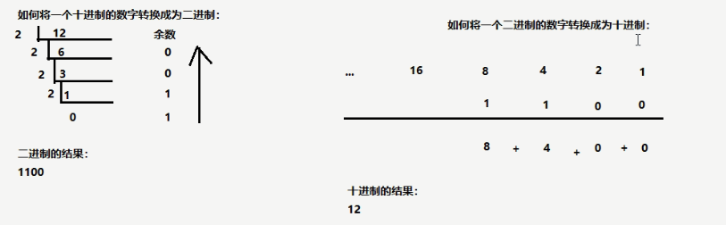
 **计算器算**
 ### 常用命令行
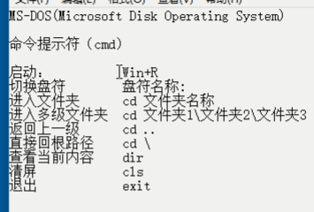
### java运行环境
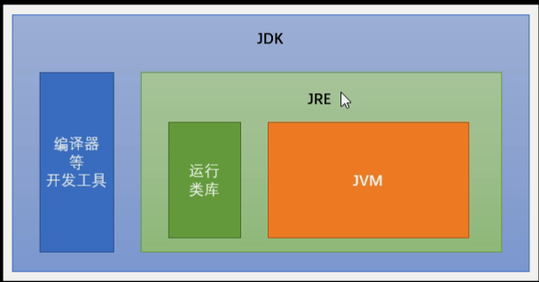

### 第一个Java程序
```java
public class HelloWord{
    public static void main(String[] args){
        System.out.println("HelloWorld!");
    }
}

```
### 关键字
1. 完全小写的
2. 在特殊文本编辑器里面有特殊颜色的     
### 标识符
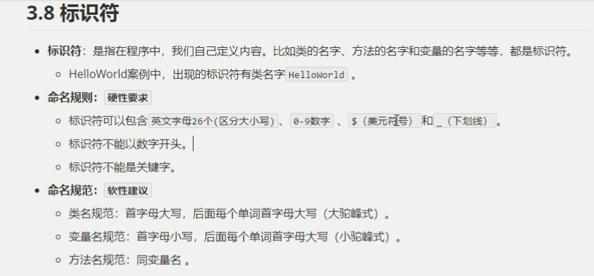
### 常量
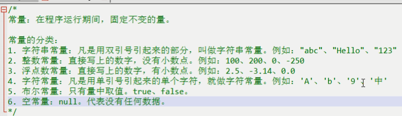
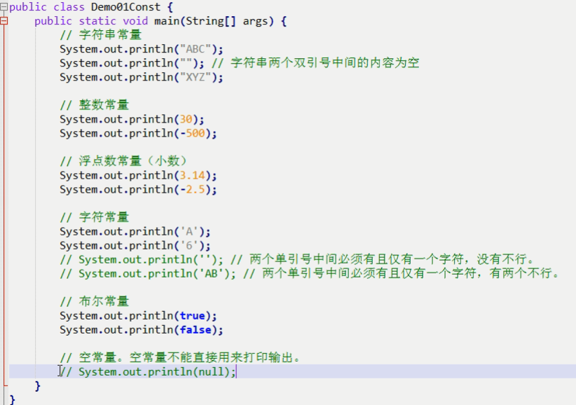
### 数据类型
基本数据类型
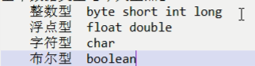
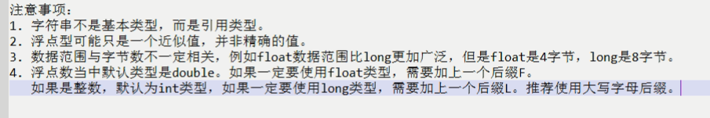
### 变量
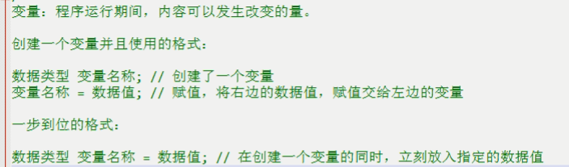
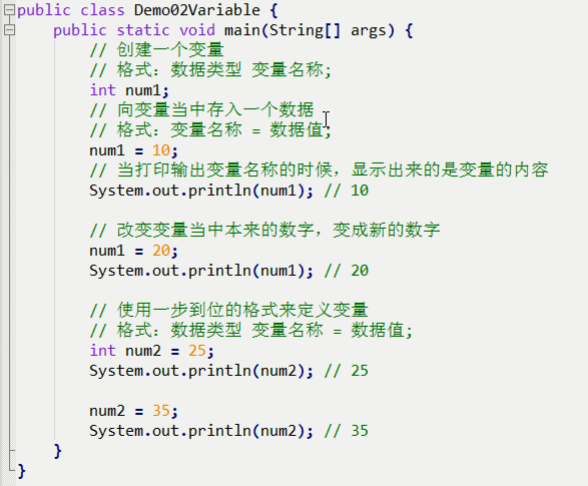
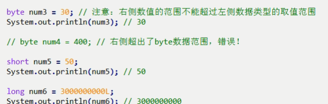
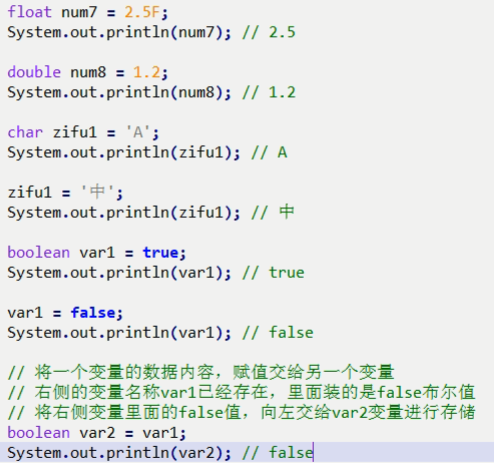 
#### 变量的注意事项
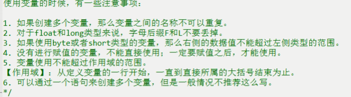
```java
public class Demo03VariableNotice {
	public static void main(String[] args) {
		int num1 = 10; // 创建了一个新的变量，名叫num1
		// int num1 = 20; // 又创建了另一个新的变量，名字也叫num1，错误！
		
		int num2 = 20;
		
		int num3;
		num3 = 30;
		
		int num4; // 定义了一个变量，但是没有进行赋值
		// System.out.println(num4); // 直接使用打印输出就是错误的！
		
		// System.out.println(num5); // 在创建变量之前，不能使用这个变量
		
		int num5 = 500;
		System.out.println(num5); // 500
		
		{
			int num6 = 60;
			System.out.println(num6); // 60
		}
		// int num6;
		// System.out.println(num6); // 已经超出了大括号的范围，超出了作用域，变量不能再使用了
		
		// 同时创建了三个全都是int类型的变量
		int a, b, c;
		// 各自分别赋值
		a = 10;
		b = 20;
		c = 30;
		System.out.println(a); // 10
		System.out.println(b); // 20
		System.out.println(c); // 30
		
		// 同时创建三个int变量，并且同时各自赋值
		int x = 100, y = 200, z = 300;
		System.out.println(x); // 100
		System.out.println(y); // 200
		System.out.println(z); // 300
	}
}
```
## 整理

---

# 总结