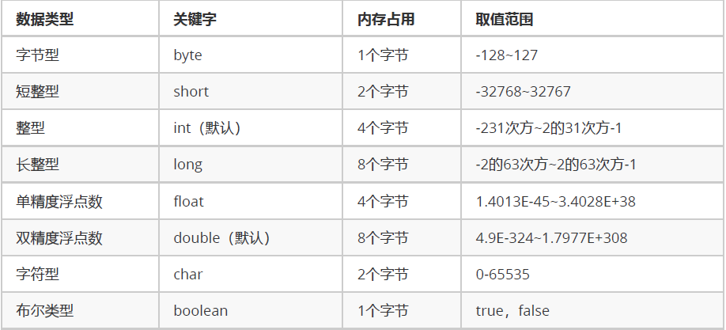

# 数据类型转换、运算符、方法入门

**关键词**

`数据类型转换`、`运算符`、`方法入门`
---

# 笔记

## 听课
## 数据类型的强制转换

1. 自动类型转换(隐式)
   1. 代码不需要处理自动完成
   2. 数据范围从小到大
```java
public class Demo01DataType {
	public static void main(String[] args) {
		System.out.println(1024); // 这就是一个整数，默认就是int类型
		System.out.println(3.14); // 这就是一个浮点数，默认就是double类型
		
		// 左边是long类型，右边是默认的int类型，左右不一样
		// 一个等号代表赋值，将右侧的int常量，交给左侧的long变量进行存储
		// int --> long，符合了数据范围从小到大的要求
		// 这一行代码发生了自动类型转换。
		long num1 = 100;
		System.out.println(num1); // 100
		
		// 左边是double类型，右边是float类型，左右不一样
		// float --> double，符合从小到大的规则
		// 也发生了自动类型转换
		double num2 = 2.5F;
		System.out.println(num2); // 2.5
		
		// 左边是float类型，右边是long类型，左右不一样
		// long --> float，范围是float更大一些，符合从小到大的规则
		// 也发生了自动类型转换
		float num3 = 30L;
		System.out.println(num3); // 30.0
	}
}
```

2. 强制类型转换(显式)
强制类型转换
   1. 特点：代码需要进行特殊的格式处理，不能自动完成。
   2. 格式：范围小的类型 范围小的变量名 = (范围小的类型) 原本范围大的数据;
```java
public class Demo02DataType {
	public static void main(String[] args) {
		// 左边是int类型，右边是long类型，不一样
		// long --> int，不是从小到大
		// 不能发生自动类型转换！
		// 格式：范围小的类型 范围小的变量名 = (范围小的类型) 原本范围大的数据;
		int num = (int) 100L;
		System.out.println(num);
```
## 运算符

## 方法

## Jshell脚本

## 扩展知识点

## 整理

---

# 总结