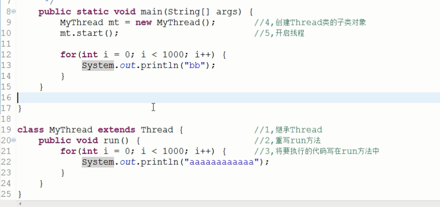

# 多线程

**关键词**


---

# 笔记

## 听课
`并行`左手操作一个电脑跟甲聊，同时右手用另一台电脑跟乙聊天

`并发`如果用一台电脑我先给甲发个消息，然后立刻再给乙发消息，然后再跟甲聊

创建多线程


- 实现Runnable方法 

```java
public class Demo3_Runnable {
				/**
				 * @param args
				 */
				public static void main(String[] args) {
					MyRunnable mr = new MyRunnable();						//4,创建自定义类对象
					//Runnable target = new MyRunnable();
					Thread t = new Thread(mr);								//5,将其当作参数传递给Thread的构造函数
					t.start();												//6,开启线程
					
					for(int i = 0; i < 3000; i++) {
						System.out.println("bb");
					}
				}
			}
			
			class MyRunnable implements Runnable {							//1,自定义类实现Runnable接口
				@Override
				public void run() {											//2,重写run方法
					for(int i = 0; i < 3000; i++) {							//3,将要执行的代码,写在run方法中
						System.out.println("aaaaaaaaaaaaaaaaaaaaaaaaaaaa");
					}
				}
				
			}
```
* 继承Thread
	* 好处是:可以直接使用Thread类中的方法,代码简单
	* 弊端是:如果已经有了父类,就不能用这种方法
* 实现Runnable接口
	* 好处是:即使自己定义的线程类有了父类也没关系,因为有了父类也可以实现接口,而且接口是可以多实现的
	* 弊端是:不能直接使用Thread中的方法需要先获取到线程对象后,才能得到Thread的方法,代码复杂

- 匿名方法实现
- 多线程的方法`getName`
- 通过构造方法改名字和通过`setName`改名字
`currentThread`获取当前执行的线程
Thread.currentThread().setName();写在哪里获取哪里的线程
设置线程的名字直接写在里面
`Thread.sleep`暂停展示 
`setDaemon`设置守护进程传入`true`为设置为守护进程
`t1.setDaemon(true);						//将t1设置为守护线程`
`join()`, 当前线程暂停, 等待指定的线程执行结束后, 当前线程再继续
`join(int)`, 可以等待指定的毫秒之后继续
`yield让出cpu`没啥用
`setPriority()`设置线程的优先级
## 整理

---

# 总结