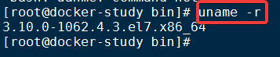
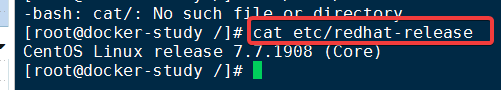
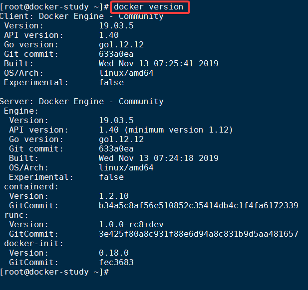
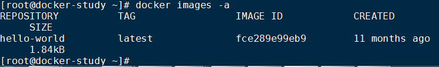
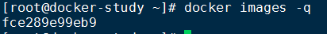
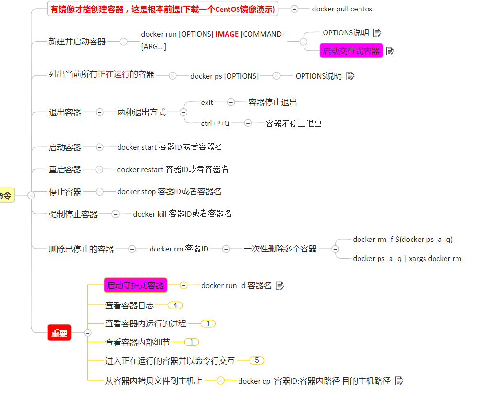

# docker

**关键词**


---

# 笔记
## 1. docker简介
- 下载 

    [docker官网](https://www.docker.com/)

    ~~[docker中文网](XXX)~~

    [Github Docker 源码](https://github.com/docker/docker-ce)

- 仓库
  
    [dcoker hub](https://hub.docker.com/)


## 2. docker安装
### 前提说明
- CentOS Docker 安装
```md
Docker支持以下的CentOS版本：
CentOS 7 (64-bit)
CentOS 6.5 (64-bit) 或更高的版本
```
- 前提条件
```md
目前，CentOS 仅发行版本中的内核支持 Docker。
Docker 运行在 CentOS 7 上，要求系统为64位、系统内核版本为 3.10 以上。
Docker 运行在 CentOS-6.5 或更高的版本的 CentOS 上，要求系统为64位、系统内核版本为 2.6.32-431 或者更高版本。
```
- 查看自己的内核
`uname -r` `uname -a`

命令用于打印当前系统相关信息（内核版本号、硬件架构、主机名称和操作系统类型等）。


`cat /etc/ redhat-release` 

查看已安装的CentOS版本信息（CentOS6.8有，CentOS7无该命令）

 
### Docker基本组成
- 镜像

Docker 镜像（Image）就是一个只读的模板。镜像可以用来创建 Docker 容器，一个镜像可以创建很多容器。


- 容器
  - Docker 利用容器（Container）独立运行的一个或一组应用。容器是用镜像创建的运行实例。
  - 它可以被启动、开始、停止、删除。每个容器都是相互隔离的、保证安全的平台。
  - 可以把容器看做是一个简易版的 Linux 环境（包括root用户权限、进程空间、用户空间和网络空间等）和运行在其中的应用程序。
  - 容器的定义和镜像几乎一模一样，也是一堆层的统一视角，唯一区别在于容器的最上面那一层是可读可写的    。

- 仓库
1. 仓库（Repository）是集中存放镜像文件的场所。

2. 仓库(Repository)和仓库注册服务器（Registry）是有区别的。仓库注册服务器上往往存放着多个仓库，每个仓库中又包含了多个镜像，每个镜像有不同的标签（tag）。

3. 仓库分为公开仓库（Public）和私有仓库（Private）两种形式。

4. 最大的公开仓库是 Docker Hub(https://hub.docker.com/)，存放了数量庞大的镜像供用户下载。国内的公开仓库包括阿里云 、网易云 等
- 总结
 需要正确的理解仓储/镜像/容器这几个概念:

 Docker 本身是一个容器运行载体或称之为管理引擎。我们把应用程序和配置依赖打包好形成一个可交付的运行环境，这个打包好的运行环境就似乎 image镜像文件。只有通过这个镜像文件才能生成 Docker 容器。image 文件可以看作是容器的模板。Docker 根据 image 文件生成容器的实例。同一个 image 文件，可以生成多个同时运行的容器实例。

 

  * image 文件生成的容器实例，本身也是一个文件，称为镜像文件。

  *  一个容器运行一种服务，当我们需要的时候，就可以通过docker客户端创建一个对应的运行实例，也就是我们的容器

  * 至于仓储，就是放了一堆镜像的地方，我们可以把镜像发布到仓储中，需要的时候从仓储中拉下来就可以了。

### docker在centos7上安装(此处是谷歌云centos7)
1. yum安装 `gcc`
```linux
yum -y install gcc

yum -y install gcc-c++
```
2.卸载旧版本
```linux
$ sudo yum remove docker \
                  docker-client \
                  docker-client-latest \
                  docker-common \
                  docker-latest \
                  docker-latest-logrotate \
                  docker-logrotate \
                  docker-selinux \
                  docker-engine-selinux \
                  docker-engine
```
3. 执行以下命令安装依赖
```md
$ sudo yum install -y yum-utils \
           device-mapper-persistent-data \
           lvm2
```
4. 国内更换源(外国服务器不需要)
```linux
# 官方源
# $ sudo yum-config-manager \
#     --add-repo \
#     https://download.docker.com/linux/centos/docker-ce.repo
# 阿里源
# yum-config-manager --add-repo http://mirrors.aliyun.com/docker-ce/linux/centos/docker-ce.repo
# 
#$ sudo yum-config-manager \
    --add-repo \
    https://mirrors.ustc.edu.cn/docker-ce/linux/centos/docker-ce.repo
```
5. 安装yum软件索引

```linux
$ sudo yum makecache fast
```
6. 安装docker ce

```linux
$ sudo yum install docker-ce
```
7. 启动docker
```linux
$ sudo systemctl enable docker
$ sudo systemctl start docker  
```

8. 测试
```linux
docker version
docker run hello-world
```
9.  配置镜像加速

```linux
mkdir-p/etc/docker #创建文件夹 -p的作用是遍历创建
vim/etc/docker/daemon.json 
systemctl daemon-reload 
systemctl restart docker
```
- daemon.json
```json
 #网易云
{"registry-mirrors": ["http://hub-mirror.c.163.com"] }
 #阿里云
{
  "registry-mirrors": ["https://｛自已的编码｝.mirror.aliyuncs.com"]
}

```
10. 卸载
```linux
systemctl stop docker 
yum -y remove docker-ce
rm -rf/var lib dcoker 
```

## 3. docker常用指令
### 帮助命令
1. `docker version`
docker版本查询

3. `docker info`
查看docker系统信息。
4. `docker --help`
### 镜像命令
1. `docker images` 

- 查出本地主机的镜像
`docker images` 

格式`dcoker images [OPTIONS]`

`-a` 列出本地所有的镜像,包含中间镜像层

`-q` 只显示镜ID


`--digests` 显示镜像的摘要信息

`--no-trunc`显示完整的镜像信息

- 联网查找某个镜像的名字
[网站](https://hub.docker.com)
命令`docker search [OPTIONDS]`镜像名字

  - [OPTIONDS] `--no-trunc` 显示完整的镜像描述
  - [OPTIONDS] `-s` 列出收藏数不小于指定的镜像
  - [OPTIONDS] `--automated` 只列出automated的build类型的镜像
- docker 拉取镜像`pull`
- 
`docker pull`镜像名字[:TAG]

TAG:是版本号


- 删除本地镜像`rmi`
  - 删除单个镜像`docker rmi -f 镜像ID`
  - 删除多个镜像`docker rmi -f 镜像1:TAG 镜像2:TAg`
  - 删除全部镜像`docker rmi $(docker images -qa)`
### 容器命令

## 4. docker镜像

## 5. docker容器卷

## 6. dockerFile解析

## 7. docker常用安装

## 8. 本地镜像发布到阿里云


---

# 总结