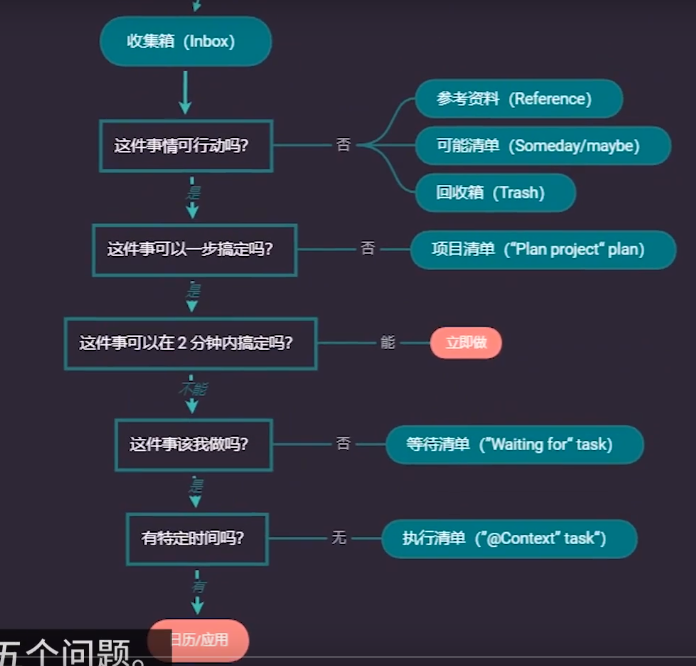

Template
# 做之前的问自己的5个问题

1. 这事情可以行动吗?--->不能--->参考
2. 这事情可以一步搞定吗?--->不能--->项目清单
3. 这事情可以2分钟搞定嘛?--->立刻做
4. 这事情是我做的吗?--->等待清单
5. 这事情有特定的时间吗?--->执行清单

## 收集箱(inbox)

### 番茄时间
- [ ] 
## 执行清单(@Context task)
## 等待清单("waiting for"task)

## 项目清单("plan project" task)
## 可能清单(somdeday/maybe)

## 参考资料(Reference)

## 回收箱(Trash)

## 日历

## 已完成